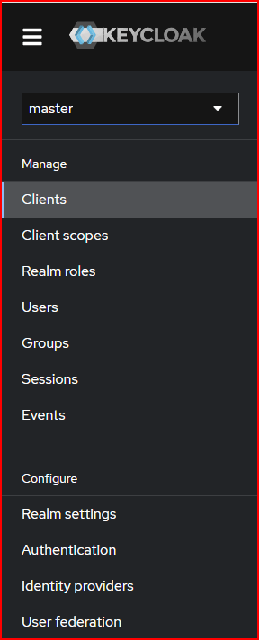
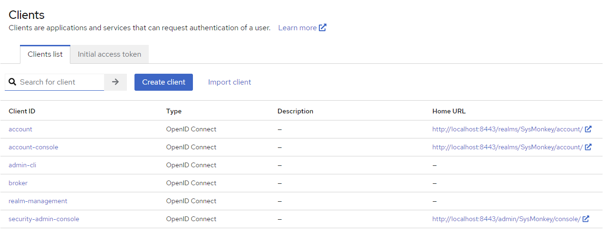
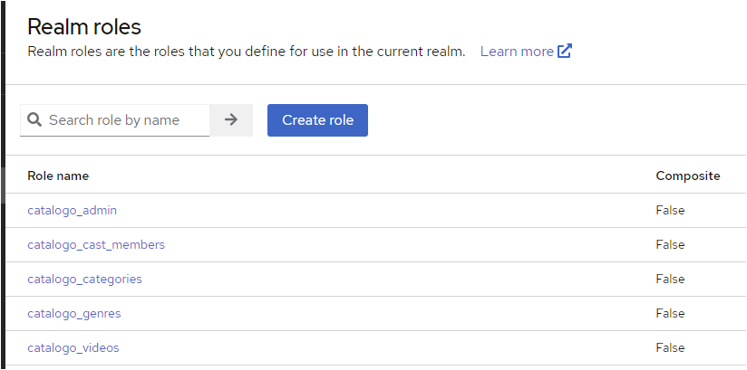
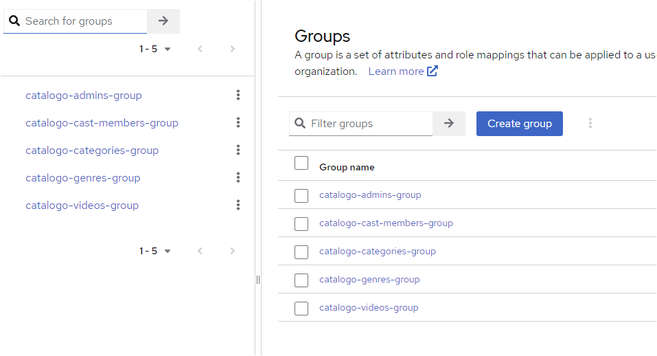
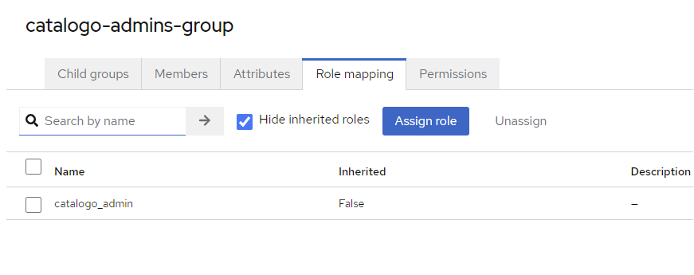

## **Manage**

Clients

> It is an application which will connect on our Realm (KeyClock)

Clients scopes

> Are the scopes attached on JWT token, what scopes exactly the client has
> Read scope, write scope, scope to see specifics fields

Realm roles

> Role admin, role to create specific resource. It is a global role
> Each client is possible to create specifics roles

Users

> Users who belongs to the Realm

Groups

> Used to make groups of roles. The best practice is create a group and assign the
> group to user, never assign specific role to the user

Sessions

> User online

Events

> Administrative logs and others.... see deep after

## **Configure**

Realm Settings

> Settigns related to realm

Authentication

Identity provides

User Federation

## **Resources**

* Create the realm
* Create the client( enable Client authentication and Service accounts roles)
* Create the realm roles
* Create the group and assign the roles
* Create the user and assign the group to user

